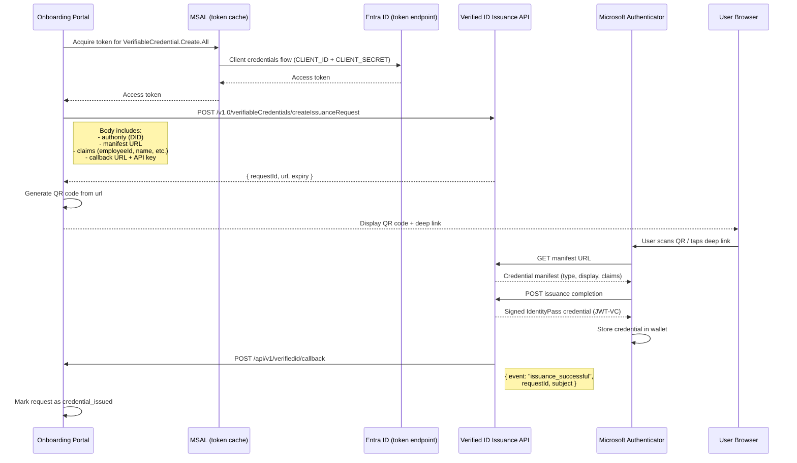
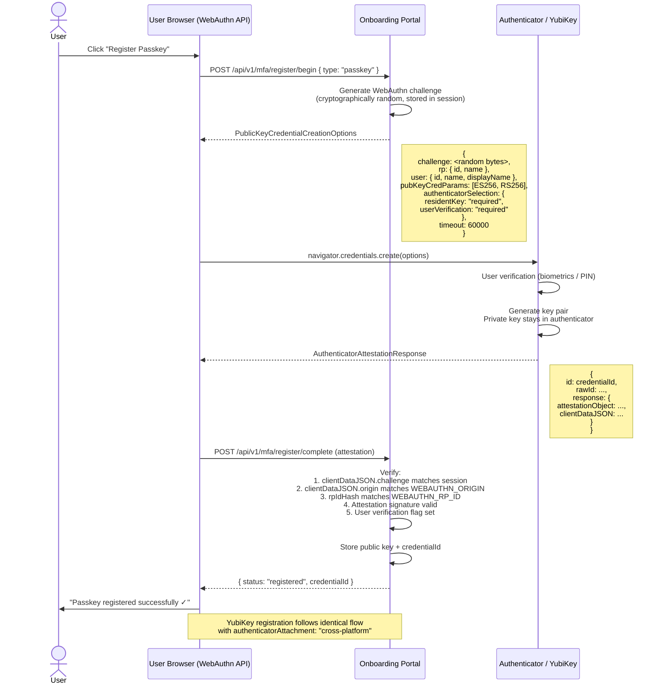

# Architecture — Entra Verified ID Onboarding Portal

This document provides the detailed architecture for the Entra Verified ID Employee & Guest Onboarding Portal. It covers component responsibilities, Azure resource dependencies, the security model, and Mermaid sequence diagrams for all major flows.

---

## Table of Contents

- [Component Overview](#component-overview)
- [Azure Resource Dependencies](#azure-resource-dependencies)
- [Sequence Diagrams](#sequence-diagrams)
  - [Full Onboarding Flow (End-to-End)](#1-full-onboarding-flow-end-to-end)
  - [Verified ID Issuance Flow](#2-verified-id-issuance-flow)
  - [Passkey Registration Flow](#3-passkey-registration-flow)
- [Security Model](#security-model)
- [Data Flow Summary](#data-flow-summary)

---

## Component Overview

```
┌──────────────────────────────────────────────────────────────────────┐
│                        Azure Subscription                            │
│                                                                      │
│  ┌─────────────────────────────────────────────────────────────┐    │
│  │                   Resource Group                             │    │
│  │                                                              │    │
│  │  ┌─────────────────┐    ┌──────────────────────────────┐   │    │
│  │  │  App Service     │    │   Azure Key Vault            │   │    │
│  │  │  (Linux, Node.js)│───▶│   (Secrets via Managed Id.) │   │    │
│  │  │                  │    └──────────────────────────────┘   │    │
│  │  │  ┌────────────┐  │                                       │    │
│  │  │  │ Express App│  │    ┌──────────────────────────────┐   │    │
│  │  │  │ + EJS Views│  │───▶│   Cosmos DB / Table Storage  │   │    │
│  │  │  └────────────┘  │    │   (Session & Request State)  │   │    │
│  │  └────────┬─────────┘    └──────────────────────────────┘   │    │
│  │           │                                                   │    │
│  └───────────┼───────────────────────────────────────────────────┘   │
│              │                                                        │
└──────────────┼────────────────────────────────────────────────────────┘
               │
               │  HTTPS
               ▼
┌──────────────────────────────────────────────────────────────────────┐
│                    Microsoft Entra ID (Cloud)                         │
│                                                                      │
│  ┌─────────────────────────┐    ┌────────────────────────────────┐  │
│  │  App Registration        │    │   Entra Verified ID Service    │  │
│  │  (OAuth2 / MSAL)         │    │   - Issuance API               │  │
│  │                          │    │   - Presentation API           │  │
│  │  API Permissions:        │    │   - DID Authority              │  │
│  │  - VerifiableCredential  │    │   - Credential Manifest        │  │
│  │    .Create.All           │    └───────────────┬────────────────┘  │
│  │  - VerifiableCredential  │                    │                   │
│  │    .Verify.All           │                    │ Callbacks (HTTPS) │
│  └─────────────────────────┘                    ▼                   │
└─────────────────────────────────────────────────────────────────────-┘
               │
               │  Issuance / Presentation
               ▼
┌─────────────────────────────────┐
│   Microsoft Authenticator App   │
│   (iOS / Android)               │
│   - Receives Verified ID cred.  │
│   - Stores in digital wallet    │
│   - Presents credential         │
└─────────────────────────────────┘

               │  FIDO2/WebAuthn
               ▼
┌─────────────────────────────────┐
│   Authenticator / YubiKey       │
│   - Passkey (phone biometrics)  │
│   - FIDO2 security key          │
└─────────────────────────────────┘
```

### Component Responsibilities

| Component | Technology | Responsibility |
|-----------|-----------|---------------|
| **Portal (App Service)** | Node.js 20, Express 4, EJS | Serves the onboarding UI; orchestrates the end-to-end flow; proxies Verified ID API calls; handles WebAuthn ceremonies |
| **Entra App Registration** | Microsoft Entra ID | OAuth2 identity for the portal; grants access to Verified ID APIs |
| **Verified ID Service** | Entra Verified ID REST API | Issues and verifies `IdentityPass` credentials; manages the DID authority and manifest |
| **Microsoft Authenticator** | Mobile app (iOS/Android) | Receives credential issuance deep links/QR codes; stores credentials in the user's digital wallet; presents credentials on request |
| **Key Vault** | Azure Key Vault | Stores `CLIENT_SECRET`, `SESSION_SECRET`, `VERIFIED_ID_CALLBACK_API_KEY`, and any other sensitive values; accessed by App Service via Managed Identity |
| **Session Store** | Cosmos DB or Azure Storage | Persists pending onboarding requests and their status across App Service instances |
| **WebAuthn (Browser API)** | W3C WebAuthn Level 2 | Performs Passkey and security key registration directly in the browser; keys never leave the authenticator hardware |

---

## Azure Resource Dependencies

```
azuredeploy.json / infra/main.bicep
  │
  ├── Microsoft.Web/serverfarms          (App Service Plan — Linux B1+)
  │     └── Microsoft.Web/sites          (App Service — Node.js 20)
  │           ├── systemAssignedIdentity  (Managed Identity for Key Vault access)
  │           └── siteConfig.appSettings  (references Key Vault secrets via @Microsoft.KeyVault(...))
  │
  ├── Microsoft.KeyVault/vaults          (Key Vault — RBAC model)
  │     └── roleAssignment               (Key Vault Secrets User → App Service MI)
  │
  ├── Microsoft.DocumentDB/databaseAccounts  (Cosmos DB — optional, for session persistence)
  │     └── sqlDatabases/containers          (sessions container)
  │
  └── Microsoft.Insights/components     (Application Insights — optional, for monitoring)
```

> **Entra Verified ID** is a tenant-level service and is **not** deployed via ARM/Bicep. It must be enabled in your Entra ID tenant before deployment. The bootstrap script (`scripts/bootstrap.ps1`) configures the tenant-level components.

---

## Sequence Diagrams

### 1. Full Onboarding Flow (End-to-End)

```mermaid
sequenceDiagram
    actor User as New User
    actor Manager as Manager
    participant Portal as Onboarding Portal
    participant VerifiedID as Entra Verified ID
    participant Authenticator as Microsoft Authenticator
    participant Browser as User Browser

    User->>Portal: POST /api/v1/onboarding/start<br/>(email, employeeId, displayName, department)
    Portal->>Portal: Create IdentityPass request<br/>Status: pending_approval
    Portal-->>User: 201 { requestId, status: "pending_approval" }

    Portal->>Manager: Email notification (approval link)

    loop Poll for status
        User->>Portal: GET /api/v1/onboarding/status/:requestId
        Portal-->>User: { status: "pending_approval" }
    end

    Manager->>Portal: POST /api/v1/manager/requests/:requestId/approve
    Portal->>VerifiedID: Request credential issuance (MSAL + Verified ID Issuance API)
    VerifiedID-->>Portal: Issuance request URL + QR code payload
    Portal-->>Manager: 200 { status: "approved" }
    Portal->>Portal: Update request status: credential_issued

    User->>Portal: GET /api/v1/onboarding/status/:requestId
    Portal-->>User: { status: "credential_issued" }

    Portal->>Browser: Display QR code / deep link for Authenticator
    User->>Authenticator: Scan QR code / tap deep link
    Authenticator->>VerifiedID: Complete issuance ceremony
    VerifiedID-->>Authenticator: IdentityPass credential stored in wallet

    VerifiedID->>Portal: POST /api/v1/verifiedid/callback (issuanceComplete)
    Portal->>Portal: Update request status: presentation_required

    Portal->>Browser: Display presentation request QR code
    User->>Authenticator: Scan QR code to present credential
    Authenticator->>VerifiedID: Present IdentityPass credential
    VerifiedID->>Portal: POST /api/v1/verifiedid/callback (presentationVerified)
    Portal->>Portal: Update request status: mfa_registration

    Portal->>Browser: Redirect to Passkey registration step
    User->>Browser: Register Passkey (phone biometrics)
    Browser->>Portal: POST /api/v1/mfa/register/begin { type: "passkey" }
    Portal-->>Browser: WebAuthn PublicKeyCredentialCreationOptions
    Browser->>Browser: WebAuthn ceremony (navigator.credentials.create)
    Browser->>Portal: POST /api/v1/mfa/register/complete (attestation)
    Portal->>Portal: Verify attestation; store credential
    Portal-->>Browser: { status: "registered" }

    Note over User,Portal: Optional: YubiKey registration follows same pattern

    Portal->>Portal: Update request status: complete
    Portal->>Browser: Onboarding complete ✓
```

---

### 2. Verified ID Issuance Flow



---

### 3. Passkey Registration Flow



---

## Security Model

### Trust Boundaries

```
[User Browser] ──HTTPS──▶ [App Service] ──HTTPS──▶ [Entra Verified ID API]
                                │
                                ├──Managed Identity──▶ [Key Vault]
                                │
                                └──HTTPS──▶ [Cosmos DB / Storage]
```

No secrets are ever transmitted to the user's browser. The portal acts as a confidential client.

### Threat Model Summary

| Threat | Mitigation |
|--------|-----------|
| **Credential forgery** | Verified ID credentials are JWT-VCs signed by the tenant DID authority; cryptographically unforgeable |
| **Replay attack on credentials** | Presentation requests include a one-time challenge; expired presentations are rejected |
| **Session hijacking** | Short-lived sessions with HTTPS-only, HttpOnly, SameSite=Strict cookies |
| **Secrets exposure** | All secrets in Key Vault; Managed Identity access only; no secrets in code or environment in production |
| **WebAuthn phishing** | RP ID binding — attestation verification fails if origin doesn't match `WEBAUTHN_RP_ID` |
| **Callback spoofing** | Callback endpoint validates `VERIFIED_ID_CALLBACK_API_KEY` on every request |
| **DEMO_MODE in production** | README and SECURITY.md clearly document the risk; Key Vault secret should enforce `false` |
| **Privilege escalation** | Manager approval is required before any credential is issued; approval is logged |
| **Dependency vulnerabilities** | `npm audit` should be run before each deployment; Dependabot enabled on repo |

### Cryptographic Primitives

| Feature | Algorithm / Standard |
|---------|---------------------|
| Verified ID credential signing | JWT-VC (ES256 — ECDSA P-256) |
| WebAuthn credential | ES256 or RS256 (authenticator choice) |
| Session signing | HMAC-SHA256 (Express session) |
| HTTPS | TLS 1.2+ (enforced by Azure App Service) |
| Key Vault access | Managed Identity (no stored credentials) |

---

## Data Flow Summary

```
1. User submits onboarding form
   → Portal validates input
   → Portal creates request record in session store (Cosmos DB / Storage)
   → Portal sends manager notification email

2. Manager approves
   → Portal acquires Entra token via MSAL (CLIENT_ID + CLIENT_SECRET from Key Vault)
   → Portal calls Verified ID Issuance API
   → Verified ID service generates issuance URL and QR code

3. User receives credential
   → User scans QR code with Microsoft Authenticator
   → Authenticator fetches manifest, completes issuance ceremony with Verified ID service
   → Verified ID service calls portal callback (authenticated with API key)
   → Portal updates request state

4. User presents credential
   → Portal requests presentation (same MSAL + Verified ID API pattern)
   → User scans QR code with Authenticator
   → Authenticator presents credential to Verified ID service
   → Verified ID service cryptographically verifies; calls portal callback
   → Portal marks user as identity-verified

5. Passkey registration
   → Portal generates WebAuthn challenge (stored in session)
   → Browser calls navigator.credentials.create() with options from portal
   → Authenticator / YubiKey generates key pair locally
   → Portal verifies attestation response; stores public key
   → User is phishing-resistant MFA onboarded
```
