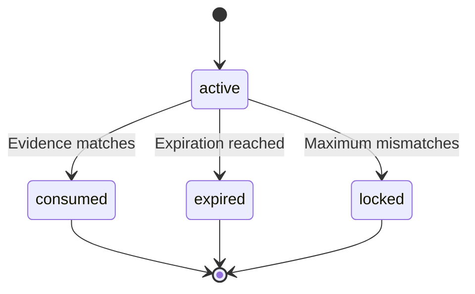

# Onboarding Architecture

## First-release flow

```mermaid
sequenceDiagram
    participant Manager as Approved manager workflow
    participant Portal as Node.js portal
    participant Graph as Microsoft Graph
    participant Mail as Approved mail provider
    participant User as New employee
    participant Entra as Microsoft Security info

    Manager->>Portal: POST /api/invitations<br/>immutable user object ID + known evidence
    Portal->>Graph: GET /v1.0/users/{object-id}
    Graph-->>Portal: Active user + directory UPN
    Portal->>Portal: Generate 256-bit token<br/>store SHA-256 hash + expiry
    Portal-->>Manager: One-time invitation URL
    Manager->>Mail: Deliver to known personal email
    Mail-->>User: Invitation URL
    User->>Portal: Open invitation and enter known email + employee ID
    Portal->>Portal: Hash/compare evidence<br/>atomic active -> consumed
    Portal->>Graph: POST temporaryAccessPassMethods<br/>single-use, short lifetime
    Graph-->>Portal: TAP value
    Portal-->>User: Display TAP once; no session/log persistence
    User->>Entra: Sign in with TAP and register passkey
    User->>Portal: Check registration
    Portal->>Graph: GET fido2Methods
    Graph-->>Portal: Tenant passkey added after invitation baseline
    Portal-->>User: Onboarding complete
```

## Trust boundaries

| Boundary | Control |
|----------|---------|
| Approval integration | `POST /api/invitations` requires a configured integration key. It is not a public manager UI. |
| Account binding | The approval request supplies an immutable Entra object ID; the portal reads and stores the directory UPN from Graph. |
| Invitation | 32 random bytes, base64url encoded; only SHA-256 hash stored. |
| Evidence | Personal email and employee ID are normalized, hashed, and compared without selecting an account in the browser. |
| Consumption | Synchronous status transition from `active` to `consumed`; replay is rejected. |
| TAP | Created after consumption, `isUsableOnce: true`, displayed once, never logged or stored in session. |
| Passkey | Production options and credential submission use Microsoft Graph v1.0. Registration is confirmed by listing the user's FIDO2 methods. |

## Invitation state

```mermaid
stateDiagram-v2
    [*] --> active
    active --> consumed: Evidence matches
    active --> expired: Expiration reached
    active --> locked: Maximum mismatches
    consumed --> [*]
    expired --> [*]
    locked --> [*]
```

The current repository is intentionally in-memory because the surrounding portal
already uses in-memory sessions and callback state. This is acceptable only for a
single always-on replica pilot. A production repository must implement transactional
compare-and-set semantics in a durable store.

## Passkey registration

The portal implements both supported paths:

1. **Microsoft-hosted web flow:** the user opens Microsoft Security info, signs
   in with TAP, registers a passkey, and the portal confirms it through
   `GET /users/{id}/authentication/fido2Methods`.
2. **Graph provisioning flow:** the portal calls
   `GET /users/{id}/authentication/fido2Methods/creationOptions`, invokes
   WebAuthn in a compatible client/origin, then sends the resulting
   `publicKeyCredential` to
   `POST /users/{id}/authentication/fido2Methods`.

Browsers enforce WebAuthn relying-party/origin rules. If Graph returns a
Microsoft-owned RP ID that is not valid for the portal origin, the portal blocks
the direct ceremony and uses the Microsoft-hosted path instead of overriding the
Graph options.

## Future partner Verified ID extension

Set `ASSURANCE_MODE=verified-id` only after an approved identity-proofing partner
contract is available. The invitation still binds the Entra object ID and known
evidence. After invitation consumption:

1. The portal requests presentation of the configured partner credential.
2. Verified ID validates signature, revocation, and linked domain.
3. The callback must contain the configured API key and original state.
4. The portal enforces credential type, accepted issuer DID, and configured UPN
   claim against the invitation-bound user.
5. Only then is the TAP created.

No provider initiation endpoint, issuance payload, claim name, or signing scheme
is assumed by this repository.

## Azure components

- Azure Container Apps hosts the Node.js portal.
- A runtime user-assigned managed identity calls Microsoft Graph and optional
  Verified ID Request Service APIs through `DefaultAzureCredential`.
- Azure Container Registry stores the application image.
- Key Vault is the intended source for session and approval integration secrets.
- GitHub Actions uses a separate OIDC deployment identity.

The invitation approval key and single always-on replica requirement still require an
infrastructure-owner handoff before live deployment.
