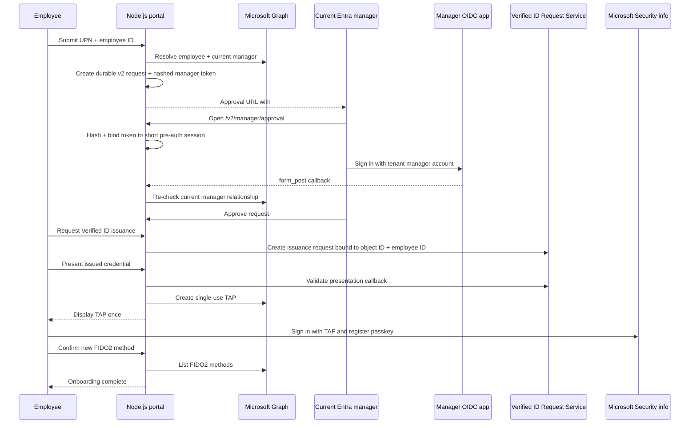

# Onboarding Architecture

## Canonical flow

```mermaid
sequenceDiagram
    participant Employee as Employee
    participant Portal as Node.js portal
    participant Graph as Microsoft Graph
    participant Manager as Current Entra manager
    participant OIDC as Manager OIDC app
    participant VID as Verified ID Request Service
    participant Entra as Microsoft Security info

    Employee->>Portal: Submit UPN + employee ID
    Portal->>Graph: Resolve employee + current manager
    Portal->>Portal: Create durable v2 request + hashed manager token
    Portal-->>Manager: Approval URL with #token fragment
    Manager->>Portal: Open /v2/manager/approval
    Portal->>Portal: Hash + bind token to short pre-auth session
    Manager->>OIDC: Sign in with tenant manager account
    OIDC-->>Portal: form_post callback
    Portal->>Graph: Re-check current manager relationship
    Manager->>Portal: Approve request
    Employee->>Portal: Request Verified ID issuance
    Portal->>VID: Create issuance request bound to object ID + employee ID
    Employee->>Portal: Present issued credential
    Portal->>VID: Validate presentation callback
    Portal->>Graph: Create single-use TAP
    Portal-->>Employee: Display TAP once
    Employee->>Entra: Sign in with TAP and register passkey
    Employee->>Portal: Confirm new FIDO2 method
    Portal->>Graph: List FIDO2 methods
    Portal-->>Employee: Onboarding complete
```

## Trust boundaries

| Boundary | Control |
|----------|---------|
| Intake | The browser submits only the employee UPN and employee ID. Graph resolves the immutable object ID and manager. |
| Manager approval | Approval links use an opaque fragment token stored only as a hash. The manager must also complete tenant OIDC sign-in with PKCE, state, nonce, tenant/object-ID validation, and the configured User app role. |
| Authorization | Portal admin access requires the configured Admin app role in the validated OIDC `roles` claim. Manager and skip-manager decisions require the configured User app role plus a live Graph relationship re-check before approval or rejection is accepted. |
| Bootstrap eligibility | Unauthenticated onboarding and recovery users have no OIDC token yet, so Graph checks direct membership in the configured NativeUsers group before creating scoped request context. Nested/transitive group membership is intentionally not a substitute. |
| Verified ID issuance | Issuance embeds the bound object ID and employee ID into the dedicated v2 credential contract. |
| Verified ID presentation | Presentation validates issuer DID, credential type, linked domain, validity window, revocation status, object ID, and employee ID. |
| State | Request state, rate limits, audit events, and session state are stored durably in Azure Table Storage. |
| TAP | TAPs are single-use, short-lived, encrypted at rest, shown once, and cleared after first display. |
| Passkey completion | Completion requires Graph to report a newly added FIDO2 method. |

## Durable request states

```mermaid
stateDiagram-v2
    [*] --> requested
    requested --> manager-notified
    manager-notified --> manager-approved
    manager-notified --> manager-rejected
    manager-approved --> credential-issued
    credential-issued --> credential-presented
    credential-presented --> verified
    verified --> tap-issued
    tap-issued --> passkey-registered
    passkey-registered --> complete
    requested --> expired
    manager-notified --> expired
    manager-approved --> expired
```

## Operational notes

- `/` is only an entry redirect to `/v2/onboarding`.
- Manager approval remains at `/v2/manager/approval` to preserve the existing
  v2 link format.
- The legacy invitation and recovery routes have been removed from the app.
- The deployment workflow and infra templates may still contain legacy
  environment variables and tables; clean those up in a dedicated infra change.
